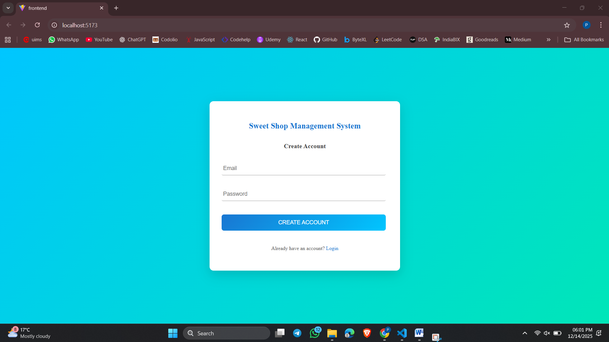
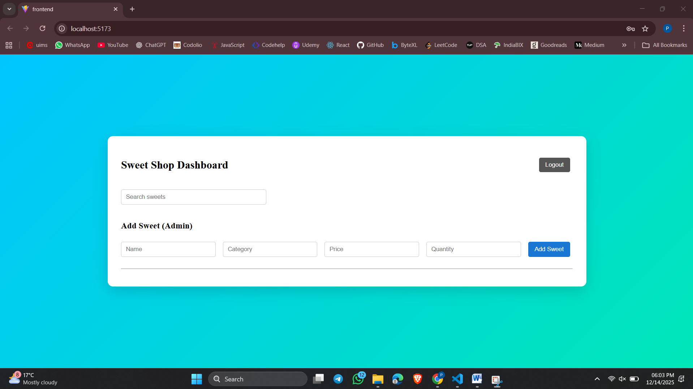
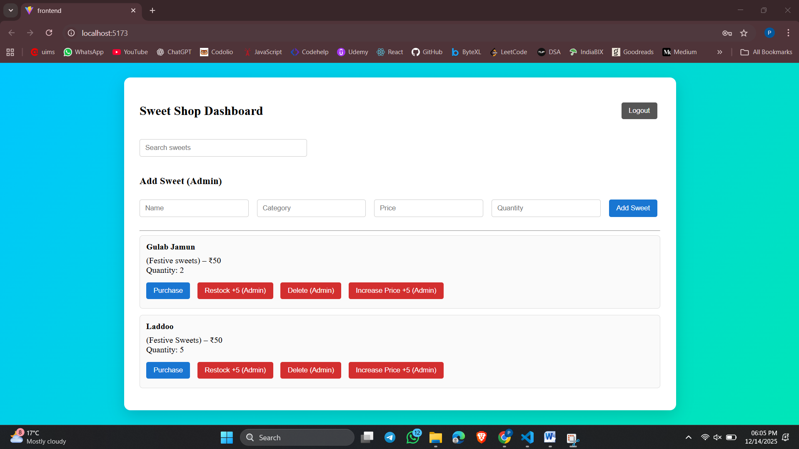
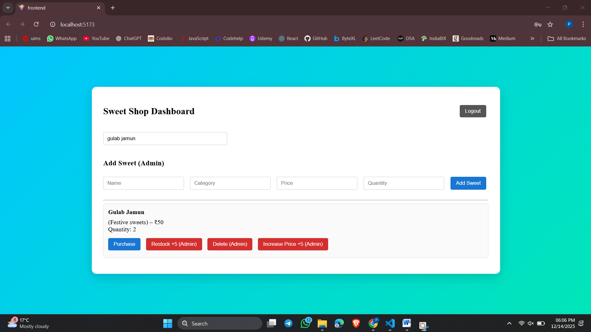

🍬 Sweet Shop Management System

A full-stack Sweet Shop Management System built as part of the Incubyte assessment.
The application allows users to register, log in, view sweets, purchase sweets, and enables admin users to manage inventory (add, update, delete, restock sweets).

🚀 Features

👤 Authentication
User Registration with validations
Email required
Password required 
Duplicate email prevention
User Login with JWT authentication
Protected routes using JWT middleware


🍭 Sweet Inventory Management

View all sweets (authenticated users)
Search sweets by name
Purchase sweets (quantity decreases)
Admin-only actions
Add sweet
Update price
Restock quantity
Delete sweet


🛡 Security & Roles

JWT-based authentication
Admin-only routes protected using middleware
Proper HTTP status codes and error messages


🧰 Tech Stack

Frontend

React (Vite)
CSS (custom styling)
Fetch API

Backend

Node.js
Express.js
SQLite (better-sqlite3)
JSON Web Tokens (JWT)


📂 Project Structure
```

incubyte-sweet-shop-management/
│
├── backend/
│ ├── src/
│ │ ├── controllers/
│ │ ├── routes/
│ │ ├── services/
│ │ ├── middlewares/
│ │ ├── db/
│ │ ├── utils/
│ │ ├── app.js
│ │ └── server.js
│
├── frontend/
│ ├── src/
│ │ ├── pages/
│ │ ├── services/
│ │ ├── index.css
│ │ ├── App.jsx
│ │ └── main.jsx
│
└── README.md
```

⚙️ Setup & Run Locally
🔹 Prerequisites

Node.js (v18+ recommended)
npm


🔹 Backend Setup

cd backend
npm install
node src/server.js

Backend will run on:

http://localhost:3000


🔹 Frontend Setup

cd frontend
npm install
npm run dev

Frontend will run on:

http://localhost:5173


Create a .env file in frontend/:

VITE_API_URL=http://localhost:3000


🧪 Test Report
Manual Test Coverage

| Feature                        | Status |
| ------------------------------ | ------ |
| User Registration              | ✅ Pass |
| Duplicate Email Handling       | ✅ Pass |
| Login with Valid Credentials   | ✅ Pass |
| Login with Invalid Credentials | ✅ Pass |
| JWT Protected Routes           | ✅ Pass |
| View Sweets                    | ✅ Pass |
| Add Sweet (Admin)              | ✅ Pass |
| Update Price (Admin)           | ✅ Pass |
| Delete Sweet (Admin)           | ✅ Pass |
| Purchase Sweet                 | ✅ Pass |
| SQLite Persistence             | ✅ Pass |


📸 Screenshots

### 🔐 Login Page


### 📝 Register Page


### 📊 Dashboard


### ➕ Add Sweet (Admin)


### 💰 Search Sweet



🤖 My AI Usage
AI Tools Used

ChatGPT (OpenAI)

How I Used AI

To reason about backend architecture, especially:

JWT authentication flow

Admin vs user authorization

To debug runtime issues, including:
HTTP 401 / 403 errors
Token handling issues
SQLite data persistence bugs

To improve frontend UI structure and styling

To refactor code for clarity and maintainability

To write and polish documentation (README.md)


Reflection on AI Impact

AI significantly improved my development speed and problem-solving ability.
Instead of trial-and-error debugging, I could reason through issues more systematically.
I ensured that all architectural and implementation decisions were understood and validated by me, and AI was used strictly as an assistant, not a replacement for reasoning or learning.


🌐 Deployment (Optional – Not Deployed)

The application is currently not deployed.


📌 Repository Link

🔗 GitHub Repository:
👉 https://github.com/prabh16/incubyte-sweet-shop-management


🙌 Final Notes

This project follows:

Clean code practices
Clear separation of concerns
Proper authentication & authorization
Transparent AI usage as required


Thank you for reviewing my submission.
